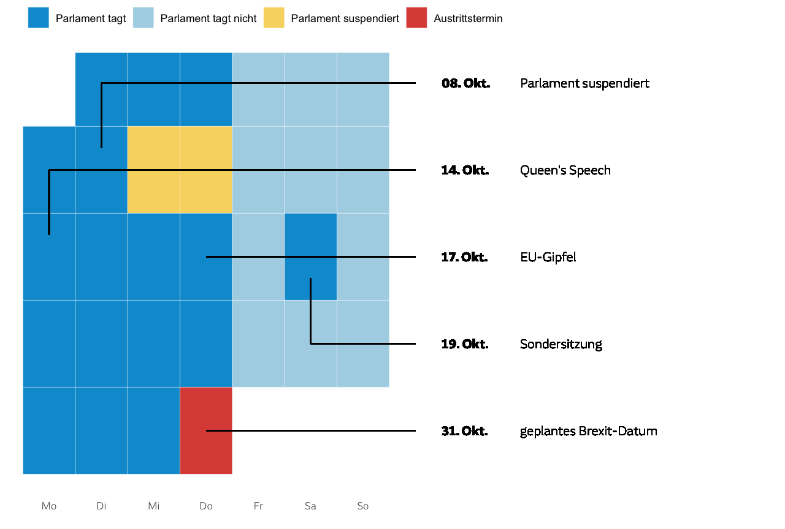

# Make a calendar with Annotations in R

Shows the code to produce a annotated calendar in ggplot.

I was inspired by an BBC News graphic that showed a calendar with Dates relevant to the Brexit, that got updated each time, something new happened. See for example [here](https://www.bbc.co.uk/news/uk-politics-32810887).

I was trying to recreate that calendar in a form that stays flexible for other use cases. This was a very quick and dirty solution, so please don't expect something extensive.

## The data

### Generally

The calendar is drawn from a csv which contains the whole month we want to show. The data comes int he following form:

| date     | category              | text                   | text_kalenderwoche | pfeil_kalenderwoche | pfeil_day_of_week |
|----------|-----------------------|------------------------|--------------------|---------------------|-------------------|
| 01.10.19 | Parlament tagt        |                        |                    |                     |                   |
| 02.10.19 | Parlament tagt        |                        |                    |                     |                   |
| 03.10.19 | Parlament tagt        |                        |                    |                     |                   |
| 04.10.19 | Parlament tagt nicht  |                        |                    |                     |                   |
| 05.10.19 | Parlament tagt nicht  |                        |                    |                     |                   |

* __date__ sets the calendar date. Currently the script is set to a German format.
* __category__ sets the fill category of the calendar. In this example: If the HoC is sitting, or not or if it's prorogued.
* __text__ contains the label that belongs to this date. It doesn't make use of that information yet, as yu still have to set the label's position manually in the next columns:
* __text_kalenderwoche__ is the week of the year (iso) where the label shows up
* __pfeil_kalenderwoche__ is the week of the year where the line will go, while
* __pfeil_day_of_week__ is the day of the week (starting at `1 = Monday`) to which the line will point.

### Examples

These lines have been extracted to provide as an example for the lines.

* `Parlament suspendiert` will be placed in week 40, its line will target the second cell on the week after that (a Tuesday).
* `Sondersitzung` is placed in week 43, while its line points to Saturday the week before.
* `geplantes Brexit-Datum` creates a horizontal line, where everything stays in week 44.

| date     | category              | text                   | text_kalenderwoche | pfeil_kalenderwoche | pfeil_day_of_week |
|----------|-----------------------|------------------------|--------------------|---------------------|-------------------|
| 08.10.19 | Parlament tagt        | Parlament suspendiert  | 40                 | 41                  | 2                 |
| 19.10.19 | Parlament tagt        | Sondersitzung          | 43                 | 42                  | 6                 |
| 31.10.19 | Austrittstermin       | geplantes Brexit-Datum | 44                 | 44                  | 4                 |
